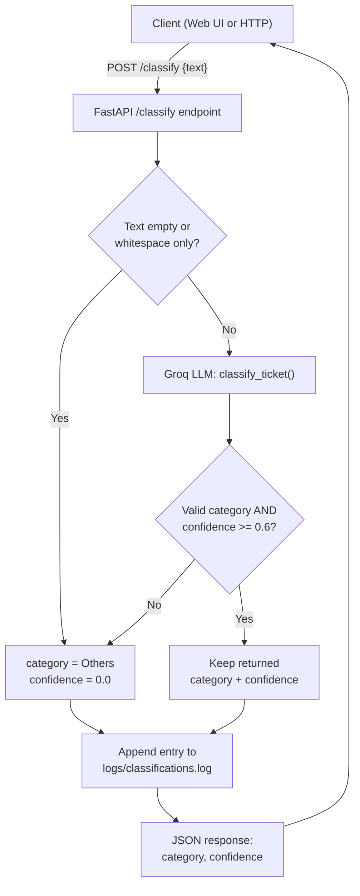
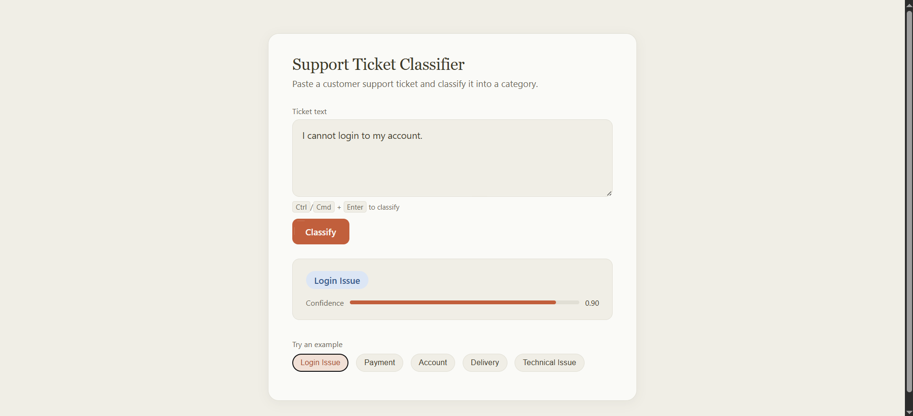

# Support Ticket Classifier

A lightweight AI-powered service that classifies free-text customer support tickets
into a fixed category, with a confidence score, a REST API, a web UI, request
logging, Docker support, and a test suite.

**Categories:** `Login Issue` · `Payment` · `Account` · `Delivery` · `Technical Issue` · `Others`

---

## Table of Contents

- [Features](#features)
- [Workflow](#workflow)
- [Approach](#approach)
- [Project Structure](#project-structure)
- [Setup](#setup)
- [Usage](#usage)
- [Screenshot](#screenshot)
- [Sample Input / Output](#sample-input--output)
- [Logging](#logging)
- [Docker](#docker)
- [Tests](#tests)
- [Assumptions](#assumptions)
- [Limitations](#limitations)

---

## Features

- LLM-based classification (Groq, `llama-3.3-70b-versatile`) into 6 fixed categories
- Confidence score returned with every classification
- Low-confidence guard: anything below `0.6` is reported as `Others` rather than a
  shaky guess
- REST API (`FastAPI`) — `POST /classify`, `GET /health`
- Minimal web UI — no build step, just static HTML/CSS/JS
- Every request logged to `logs/classifications.log` (input + output)
- Fails safe: a broken/unavailable LLM call never crashes a request — it degrades to
  `Others` with `0.0` confidence
- Dockerfile for containerized deployment
- Unit + API test suite (LLM mocked, runs fully offline)

---

## Workflow



---

## Approach

I used an **LLM API (Groq)** rather than rule-based logic or a locally trained model:

- **Accuracy on open-ended text.** Support tickets are free-form natural language.
  Keyword rules break down quickly ("payment was deducted twice" vs. "how do I make a
  payment" need different handling), and a traditional ML model would need a labelled
  training set that doesn't exist here.
- **Zero training data required.** An LLM can classify well from category names and a
  short guideline in the prompt alone (zero-shot), which fits a 6-category,
  no-dataset problem like this one much better than training a classifier from scratch.
- **Groq specifically**: free tier, extremely fast (LPU inference), and
  OpenAI-compatible, so swapping to another provider later is a one-line change.

**How it works** ([app/classifier.py](app/classifier.py)):
1. The ticket text is sent to Groq with a system prompt that lists the 6 categories,
   a one-line guideline per category, and asks for a strict JSON response:
   `{"category": ..., "confidence": ...}`.
2. If the returned category isn't one of the 6 valid ones, it's coerced to `Others`.
3. **Bonus rule applied:** if `confidence < 0.6`, the category is forced to `Others`
   regardless of what the model returned, since a low-confidence guess is better
   reported as unclassified than as a wrong specific category.
4. If the API call fails, times out, or returns unparsable output, the function
   fails safe and returns `{"category": "Others", "confidence": 0.0}` instead of
   crashing the request.
5. The API layer ([app/main.py](app/main.py)) logs the input and outcome of every
   request to `logs/classifications.log`.

---

## Project Structure

```
.
├── app/
│   ├── main.py             # FastAPI app — REST endpoints + serves the web UI
│   ├── classifier.py       # LLM call, prompt, confidence threshold logic
│   ├── schemas.py          # Pydantic request/response models + category list
│   └── logging_config.py   # File logger — writes to logs/classifications.log
├── static/
│   └── index.html          # Web UI (plain HTML/CSS/JS, no build step)
├── tests/
│   ├── test_classifier.py  # Unit tests for classification logic (LLM mocked)
│   └── test_api.py         # API tests via FastAPI TestClient (classifier mocked)
├── logs/
│   └── classifications.log # Auto-created — one line per request (input + output)
├── Dockerfile
├── requirements.txt
├── requirements-dev.txt    # requirements.txt + pytest/httpx for testing
└── .env.example
```

---

## Setup

### 1. Create a virtual environment

```bash
python -m venv venv

# Windows
venv\Scripts\activate

# Mac/Linux
source venv/bin/activate
```

### 2. Install dependencies

```bash
pip install -r requirements.txt
# or, to also run the tests:
pip install -r requirements-dev.txt
```

### 3. Configure your API key

```bash
cp .env.example .env
```

Edit `.env`:

```env
GROQ_API_KEY=your_groq_api_key_here
GROQ_MODEL=llama-3.3-70b-versatile
CONFIDENCE_THRESHOLD=0.6
```

Get a free key at [console.groq.com](https://console.groq.com).

### 4. Run the server

```bash
uvicorn app.main:app --reload --port 8000
```

Open http://localhost:8000 for the web UI.

---

## Usage

### Web UI

Go to http://localhost:8000, type or paste a ticket, then click **Classify**
(or `Ctrl`/`Cmd` + `Enter`, or click one of the example chips).

### REST API

| Method | Endpoint | Description |
|---|---|---|
| POST | `/classify` | Classify a ticket. Body: `{"text": "..."}` |
| GET | `/health` | Health check — `{"status": "ok"}` |

```bash
curl -X POST http://localhost:8000/classify \
  -H "Content-Type: application/json" \
  -d '{"text": "I cannot login to my account."}'
```

```json
{"category": "Login Issue", "confidence": 0.9}
```

---

## Screenshot



---

## Sample Input / Output

Verified against the live Groq API:

| Input | Category | Confidence |
|---|---|---|
| "I cannot login to my account." | Login Issue | 0.90 |
| "Payment was deducted twice." | Payment | 0.90 |
| "How can I change my password?" | Account | 0.90 |
| "My order hasn't arrived." | Delivery | 0.90 |
| "App crashes after opening." | Technical Issue | 0.90 |

---

## Logging

Every call to `/classify` is appended as one line to `logs/classifications.log`
(auto-created on first run), recording the input text and the resulting category
and confidence:

```
2026-07-14 22:04:29,301 | INPUT="Payment was deducted twice." | OUTPUT=category=Payment confidence=0.9
```

Failed requests (e.g. missing API key) are logged with `ERROR=...` instead of `OUTPUT=...`.
In Docker, mount a volume (e.g. `-v $(pwd)/logs:/app/logs`) if you want logs to
persist outside the container.

---

## Docker

```bash
docker build -t ticket-classifier .
docker run -p 8000:8000 --env-file .env ticket-classifier
```

To persist logs on the host:

```bash
docker run -p 8000:8000 --env-file .env -v "$(pwd)/logs:/app/logs" ticket-classifier
```

---

## Tests

```bash
pytest
```

Tests mock the LLM call, so they run offline with no API key required and cover:
- Empty/whitespace input → `Others`
- Valid category + high confidence → kept as-is
- Confidence below 0.6 → downgraded to `Others`
- Category outside the fixed list → coerced to `Others`
- LLM/API failure → fails safe to `Others` instead of raising
- API endpoints (`/health`, `/classify`) including validation and error responses

---

## Assumptions

- One ticket is classified into exactly one category — no multi-label classification.
- The 6 categories given in the assignment are treated as fixed and exhaustive;
  anything not clearly matching one of the first 5 falls into `Others`.
- A single free-text `text` field is sufficient input (no separate subject/body,
  customer metadata, or attachments to consider).
- Groq's free tier is an acceptable dependency for this exercise; no offline/local
  model requirement was implied by the assignment.

## Limitations

- Requires network access and a valid `GROQ_API_KEY`; without it, every ticket
  falls back to `Others` with confidence `0.0` rather than raising an error.
- No persistence beyond the log file — classifications aren't stored in a database;
  this is a stateless classify-on-request service, not a ticketing system.
- No authentication/rate limiting on the API — not intended for public deployment
  as-is.
- Confidence scores are the model's own self-reported estimate, not a calibrated
  statistical probability — they're a useful heuristic, not a guarantee.
- Non-English tickets or highly ambiguous/multi-issue tickets are more likely to be
  misclassified or land in `Others`.
